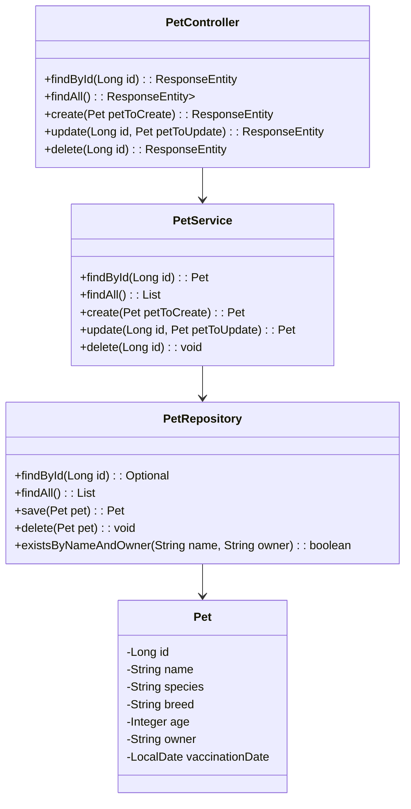

Collecting workspace information# Pet Management API

Java RESTful API criada para gerenciamento de pets.

## Principais Tecnologias
 - **Java 17**: Utilizamos a versão LTS mais recente do Java para tirar vantagem das últimas inovações que essa linguagem robusta e amplamente utilizada oferece;
 - **Spring Boot 3**: Trabalhamos com a versão 3.1.2 do Spring Boot, que maximiza a produtividade do desenvolvedor por meio de sua poderosa premissa de autoconfiguração;
 - **Spring Data JPA**: Exploramos como essa ferramenta simplifica nossa camada de acesso aos dados, facilitando a integração com bancos de dados SQL;
 - **OpenAPI (Swagger)**: Criamos uma documentação de API eficaz e fácil de entender usando a OpenAPI (Swagger), perfeitamente alinhada com a alta produtividade que o Spring Boot oferece;
 - **H2 Database**: Banco de dados em memória utilizado em ambiente de desenvolvimento;
 - **PostgreSQL**: Banco de dados relacional utilizado em ambiente de produção.

## Principais Funcionalidades

Esta API permite:
 - Cadastrar novos pets
 - Buscar pets por ID
 - Listar todos os pets cadastrados
 - Atualizar informações de pets existentes
 - Excluir registros de pets

## Diagrama de Classes (Domínio da API)

## Documentação da API

A documentação da API está disponível através do Swagger UI:

http://localhost:8080/swagger-ui/index.html

## Ambientes

O projeto está configurado com dois perfis:
- **default**: Utiliza o banco H2 em memória
- **prd**: Configurado para usar PostgreSQL com variáveis de ambiente

## Deploy

O projeto pode ser facilmente implantado em plataformas como Railway, que oferece PostgreSQL como serviço. Para deploy em produção, é necessário configurar as variáveis de ambiente PostgreSQL (PGHOST, PGPORT, PGDATABASE, PGUSER, PGPASSWORD).